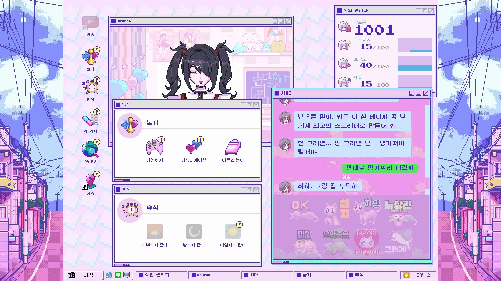

# NGOKoreanFontPatch
니디 걸 오버도즈 한국어 폰트 개선 패치

## 뭐하는 물건인가?
니디 걸 오버도즈(NEEDY GIRL OVERDOSE / NEEDY STREAMER OVERLOAD)의 한국어 폰트를 PC통신 느낌의 폰트로 대체하는 모드입니다.

Before                                          | After
:----------------------------------------------:|:----------------------------------------------:
 | 
 | 

## 왜 만들었는가?
니디 걸 오버도즈는 옛날 90년대 도스, 윈도우 시절 게임들을 모티브로 했는데, 그래서 다른 언어들은 픽셀 느낌이 나는 폰트를 사용하지만 한국어판은 누군가가 가독성이 좋지 않다는 이유로 항의를 하여 본고딕(Noto Sans KR)으로 바뀌었습니다. 이 점이 마음에 들지 않아서 만들었습니다.

## 어떻게 설치하는가?
1. 스팀 라이브러리 - 니디 걸 오버도즈에 우클릭 - 속성 - 업데이트로 들어가서 빌드 ID를 확인합니다.
1. [여기](https://github.com/na1307/NGOKoreanFontPatch/releases/latest)로 들어가서 빌드 ID를 확인합니다. 빌드 ID가 다르다면 패치가 게임과 호환되지 않습니다. 게임을 업데이트 하거나 [이슈](https://github.com/na1307/NGOKoreanFontPatch/issues)에다가 업데이트를 요청하세요. 빌드 ID가 같다면 7z 파일을 다운받습니다.
1. 다운받은 7z 파일의 압축을 풉니다.
1. 스팀 라이브러리 - 니디 걸 오버도즈에 우클릭 - 속성 - 설치된 파일 - 설치 폴더 이동
1. sharedassets0.assets 파일을 Windose_Data 폴더에 복사하고 덮어씁니다.
1. catalog.json 파일을 Windose_Data\StreamingAssets\aa 폴더에 복사하고 덮어씁니다.
1. defaultlocalgroup_assets_all_(임의의 영숫자).bundle 파일을 Windose_Data\StreamingAssets\aa\StandaloneWindows64 폴더에 복사하고 덮어씁니다.

## 어떻게 제거하는가?
스팀 라이브러리 - 니디 걸 오버도즈에 우클릭 - 속성 - 설치된 파일 - 게임 파일 무결성 검사

찜찜하다면 게임을 제거하고 게임 폴더를 완전히 삭제하고 다시 재설치해도 됩니다. 다만 이렇게 하면 진행 상황이 전부 날아가니, Settings.es3 파일(그리고 필요에 따라 다른 es3 파일들)을 백업하시는 것이 좋습니다.

## Credits
* [@nesrak1](https://github.com/nesrak1), who created [UABEA](https://github.com/nesrak1/UABEA) and [CRC cleaning tool](https://github.com/nesrak1/AddressablesTools)
* 이 프로젝트는 [Neo둥근모](https://neodgm.dalgona.dev/) 폰트를 사용합니다.
